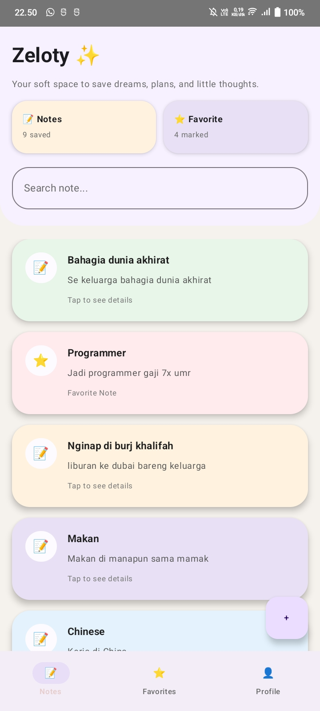
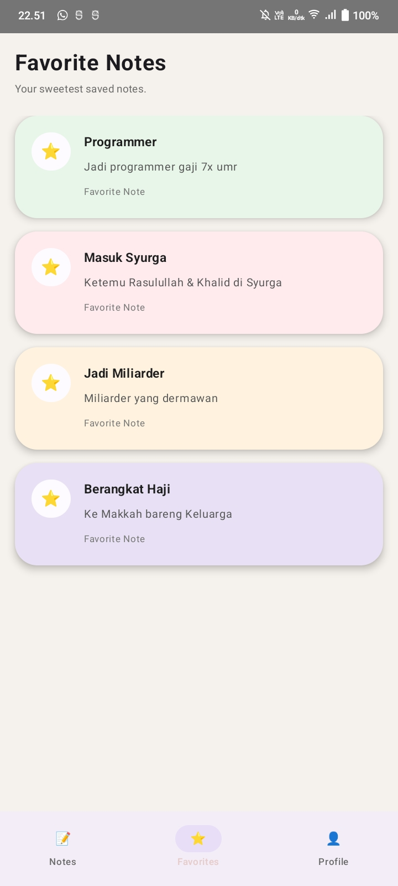
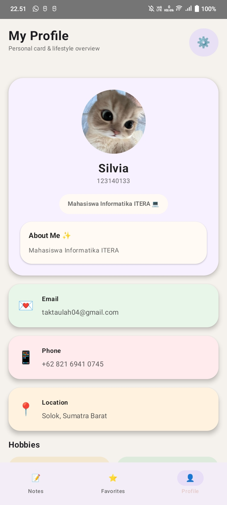
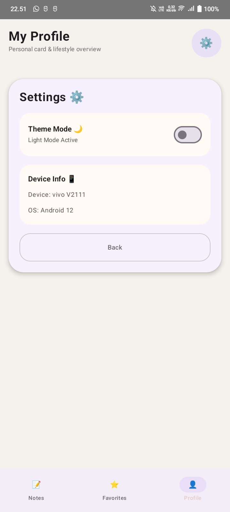
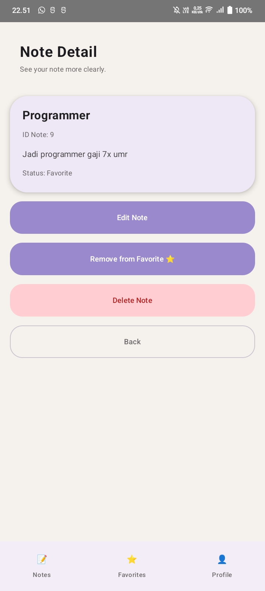
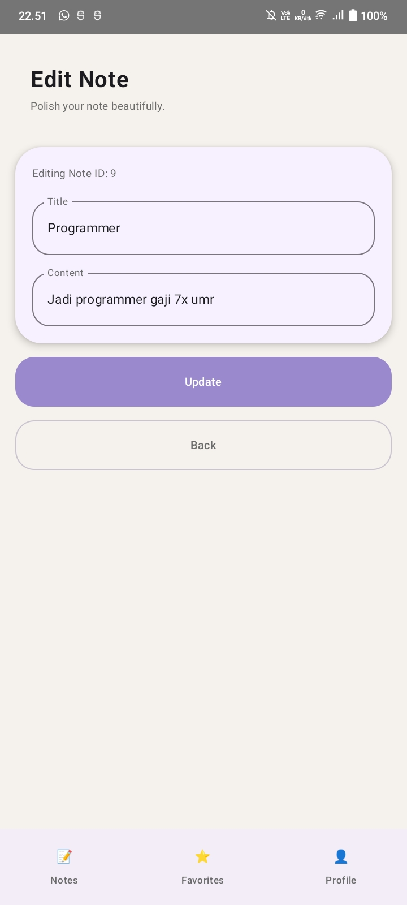
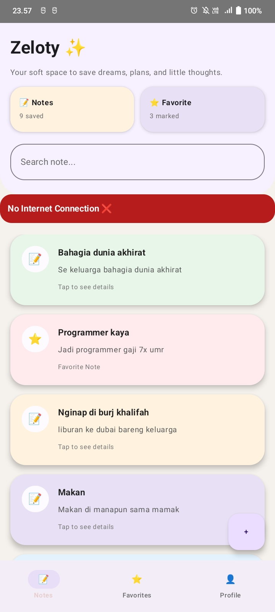
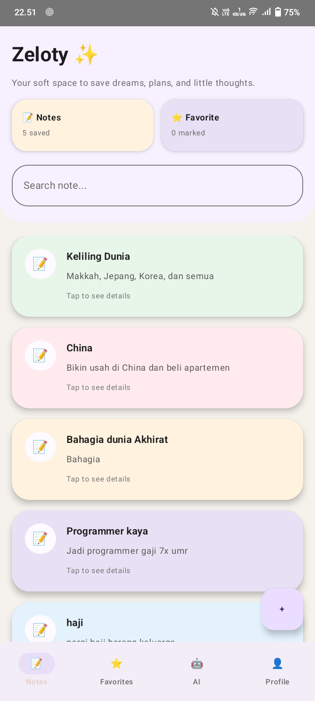
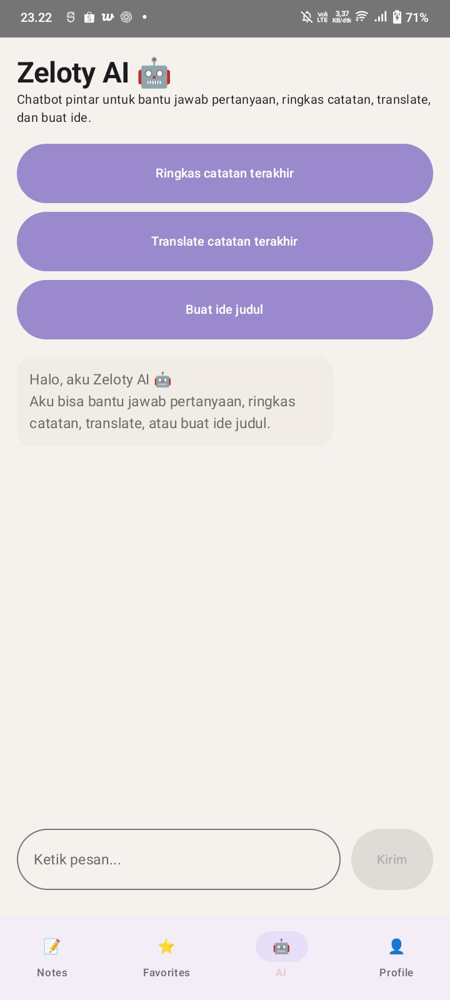

# 📱✨ Zeloty App ✨📱  
## 💜 Aesthetic Smart Notes App with AI Assistant 💜

  <i>"Your soft space to save dreams, plans, and little thoughts."</i> 🌸

---

# 🌸 About Zeloty App

**Zeloty App** adalah aplikasi catatan digital modern dengan tampilan pastel aesthetic yang dibuat sebagai tempat nyaman untuk menyimpan mimpi, ide, rencana hidup, dan cerita sehari-hari ✨

Bukan sekadar notes biasa, Zeloty App membantu pengguna menulis dan mengelola catatan dengan suasana yang cozy, estetik, dan modern 💜

Aplikasi ini dirancang untuk membantu pengguna menyimpan:
- 💭 Ide dan mimpi
- 📝 Catatan harian
- ⭐ Wishlist & goals
- 🤖 Ringkasan dan bantuan AI sederhana

Dengan UI yang clean dan calming, Zeloty App memberikan pengalaman menulis catatan yang lebih nyaman, modern, dan estetik 💜

---

# 🎯 Main Features

## 🏠 Home Notes Screen
Halaman utama untuk melihat semua catatan dengan tampilan card pastel aesthetic ✨

Fitur:
- 🔍 Search notes
- ➕ Floating add button
- 📝 List catatan modern
- 🌸 Soft pastel UI
- ⭐ Quick favorite access

---

## ⭐ Favorite Notes
Semua catatan favorit akan tersimpan di halaman khusus favorite 💛

Fitur:
- ⭐ Menandai note favorit
- 📂 Favorite page terpisah
- ⚡ Favorite realtime update
- 🎨 Colorful aesthetic cards

---

## 👤 Profile Screen
Halaman profile user dengan desain minimalis dan modern 🌸

Menampilkan:
- 👩 Foto profile
- 📧 Email user
- 📱 Nomor telepon
- 📍 Lokasi
- 💖 Hobby & bio singkat

---

## 🌐 Network Monitor
Aplikasi dapat mendeteksi koneksi internet secara realtime ✨

Ketika offline:
- 🚫 Akan muncul alert “No Internet Connection”
- ⚡ Monitoring status internet otomatis

---

## 📝 Notes Dashboard
Tampilan notes yang lebih clean dan rapi untuk mengelola catatan pengguna 💜

Fitur:
- 📄 Multiple notes cards
- ✨ Responsive layout
- 🌸 Smooth navigation

---

## 🤖 Zeloty AI Assistant
AI sederhana yang membantu pengguna mengelola catatan ✨

Fitur AI:
- 📚 Ringkas catatan
- 🌍 Translate note
- 🪄 Generate ide judul
- 💬 Chat interaction sederhana

---

## ⚙️ Settings Screen
Halaman pengaturan aplikasi dengan tampilan clean minimal 🌙

Fitur:
- 🌗 Dark & Light mode
- 📱 Device information
- ⚙️ System settings

---

## 📄 Note Detail
Halaman detail catatan dengan aksi lengkap ✨

Fitur:
- ✏️ Edit note
- ⭐ Add/remove favorite
- 🗑️ Delete note
- 📋 View detail content

---

## ✏️ Edit Note Screen
Pengguna dapat mengedit catatan dengan tampilan form modern 💜

Fitur:
- 📝 Edit title
- 📄 Edit content
- 💾 Update note realtime

---

# 🧩 Technology Used

| 💻 Technology | ✨ Description |
|---|---|
| Kotlin | Bahasa utama aplikasi |
| Jetpack Compose | Modern Android UI |
| Koin | Dependency Injection |
| MVVM | Clean Architecture |
| Material 3 | Modern UI Components |
| StateFlow | Reactive state management |

---

# 🌈 UI Design Concept

Zeloty App menggunakan konsep desain:

- 🌸 Pastel Aesthetic
- 💜 Soft Minimalism
- ✨ Rounded Components
- ☁️ Calm & Cozy Experience
- 🎀 Feminine Modern UI

Tujuannya agar aplikasi terasa nyaman digunakan untuk menulis ide, mimpi, dan catatan harian 💖

---

# 🎥 Demo Video

  

✨ Klik tombol di atas untuk melihat demo aplikasi Zeloty App ✨

---

